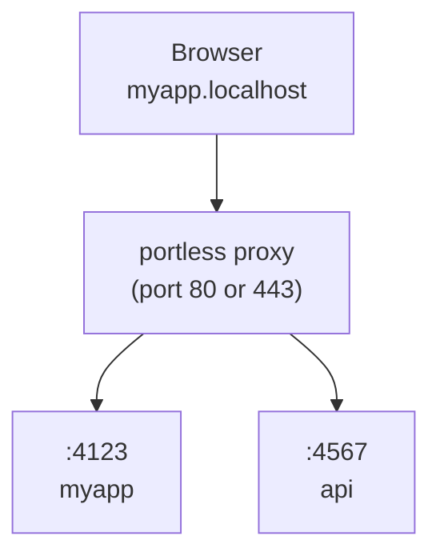

# portless

Replace port numbers with stable, named .localhost URLs for local development. For humans and agents.

```diff
- "dev": "next dev"                  # http://localhost:3000
+ "dev": "portless run next dev"     # https://myapp.localhost
```

## Install

**Global (recommended):**

```bash
npm install -g portless
```

**Or as a project dev dependency:**

```bash
npm install -D portless
```

> portless is pre-1.0. When installed per-project, different contributors may run different versions. The state directory format may change between releases, which can require re-running `portless trust`.

## Run your app

```bash
portless myapp next dev
# -> https://myapp.localhost
```

HTTPS with HTTP/2 is enabled by default. On first run, portless generates a local CA, trusts it, and binds port 443 (auto-elevates with sudo on macOS/Linux). Use `--no-tls` for plain HTTP.

The proxy auto-starts when you run an app. A random port (4000-4999) is assigned via the `PORT` environment variable. Most frameworks (Next.js, Express, Nuxt, etc.) respect this automatically. For frameworks that ignore `PORT` (Vite, VitePlus, Astro, React Router, Angular, Expo, React Native), portless auto-injects the right `--port` flag and, when needed, a matching `--host` flag.

When auto-starting, portless reuses the configuration (port, TLS, TLD) from the most recent proxy run, so a restart or reboot does not silently revert to defaults. Explicit env vars (`PORTLESS_PORT`, `PORTLESS_HTTPS`, etc.) always take priority.

In non-interactive environments (no TTY, or `CI=1`), portless exits with a descriptive error instead of prompting, so task runners like turborepo and CI scripts fail early with a clear message.

## Configuration

Bare `portless` works out of the box. It runs the `"dev"` script from `package.json` through the proxy, inferring the app name from the package name, git root, or directory:

```bash
portless        # -> runs "dev" script, https://<project>.localhost
```

Use an optional `portless.json` to override defaults:

```json
{ "name": "myapp" }
```

```bash
portless        # -> runs "dev" script, https://myapp.localhost
```

The script defaults to `"dev"`. The name is inferred from `package.json` if not set in config.

### Monorepo

One `portless.json` at the repo root covers all workspace packages. Portless discovers packages from `pnpm-workspace.yaml`, or the `"workspaces"` field in `package.json` (npm, yarn, bun):

```json
{
  "apps": {
    "apps/web": { "name": "myapp" },
    "apps/api": { "name": "api.myapp" }
  }
}
```

```bash
portless        # from repo root: starts all workspace packages with a "dev" script
cd apps/web && portless   # start just one package
```

The `apps` map is optional and only needed for name overrides. Packages not listed still auto-discover with names inferred from their `package.json`.

Without an `apps` map, hostnames follow the `<package>.<project>.localhost` convention. The project name comes from the most common npm scope across workspace packages (e.g. `@myorg/web` and `@myorg/api` produce `myorg`), falling back to the workspace root directory name. If a package's short name matches the project name, it gets the bare `<project>.localhost` without duplication.

### Config fields

| Field     | Type    | Default  | Description                                               |
| --------- | ------- | -------- | --------------------------------------------------------- |
| `name`    | string  | inferred | Base app name. Worktree prefix still applies.             |
| `script`  | string  | `"dev"`  | Name of a `package.json` script to run.                   |
| `appPort` | number  | auto     | Fixed port for the child process.                         |
| `proxy`   | boolean | auto     | Whether to route through the proxy. Auto-detected.        |
| `apps`    | object  |          | Overrides for workspace packages, keyed by relative path. |
| `turbo`   | boolean | `true`   | Set `false` to use direct spawning instead of turborepo.  |

### package.json "portless" key

Instead of a separate `portless.json`, you can add a `"portless"` key to your `package.json`. A string value is shorthand for setting the name:

```json
{
  "name": "@myorg/web",
  "portless": "myapp"
}
```

An object supports all per-app fields (`name`, `script`, `appPort`, `proxy`):

```json
{
  "name": "@myorg/web",
  "portless": { "name": "myapp", "script": "dev:app" }
}
```

The `package.json` `"portless"` key takes precedence over `portless.json` app entries but is overridden by CLI flags.

### --script flag

Override the default script for a single invocation:

```bash
portless --script start       # run "start" instead of "dev"
portless --script test        # run "test" instead of "dev"
```

### Turborepo

To use portless with turborepo, put `portless` as the `dev` script and the real command in a separate script:

```json
{
  "scripts": {
    "dev": "portless",
    "dev:app": "next dev"
  },
  "portless": { "name": "myapp", "script": "dev:app" }
}
```

Turbo runs each package's `dev` script, which invokes portless. Portless reads the config, detects the package manager, and runs `pnpm run dev:app` (or yarn/bun/npm) through the proxy. No changes to `turbo.json` are needed.

`pnpm dev` at the root works through turbo as usual. People without portless can run `pnpm run dev:app` directly.

## Use in package.json

You can still use portless in `package.json` scripts:

```json
{
  "scripts": {
    "dev": "portless run next dev"
  }
}
```

With a `portless.json`, you can simplify to:

```json
{
  "scripts": {
    "dev": "next dev"
  }
}
```

Then run `portless` or `portless run` to go through the proxy.

## Subdomains

Organize services with subdomains:

```bash
portless api.myapp pnpm start
# -> https://api.myapp.localhost

portless docs.myapp next dev
# -> https://docs.myapp.localhost
```

By default, only explicitly registered subdomains are routed (strict mode). Use `--wildcard` when starting the proxy to allow any subdomain of a registered route to fall back to that app (e.g. `tenant1.myapp.localhost` routes to the `myapp` app without extra registration).

## Multiplexed Hostnames

By default, registering the same hostname twice is a conflict. Start the proxy with `--multiplex` to allow multiple apps to share one hostname:

```bash
portless proxy start --multiplex
portless myapp next dev
portless myapp vite dev
```

If only one `myapp.localhost` app is running, requests go straight to it. If more than one app is running, portless shows a selector page the first time you visit the hostname, including host, port, PID, git branch, folder, and command details for each app. Your choice is stored in a host-scoped cookie so page loads, assets, API requests, and WebSockets keep going to the selected app. HTML responses also get a collapsed portless switcher that follows the system theme. Expand it to change or clear the selected app and inspect the same details.

For single-host public gateways, set `PORTLESS_PUBLIC_ORIGIN` to your external URL (for example `https://abc.w.modal.host`) and keep `--multiplex` enabled. Portless keeps per-app route identities internally, but serves the selector and app traffic from that one public host.

## Git Worktrees

`portless run` automatically detects git worktrees. In a linked worktree, the branch name is prepended as a subdomain so each worktree gets its own URL without any config changes:

```bash
# Main worktree (no prefix)
portless run next dev   # -> https://myapp.localhost

# Linked worktree on branch "fix-ui"
portless run next dev   # -> https://fix-ui.myapp.localhost
```

Use `--name` to override the inferred base name while keeping the worktree prefix:

```bash
portless run --name myapp next dev   # -> https://fix-ui.myapp.localhost
```

Put `portless run` in your `package.json` once and it works everywhere. The main checkout uses the plain name, each worktree gets a unique subdomain. No collisions, no `--force`.

## Custom TLD

By default, portless uses `.localhost` which auto-resolves to `127.0.0.1` in most browsers. If you prefer a different TLD (e.g. `.test`), use `--tld`:

```bash
portless proxy start --tld test
portless myapp next dev
# -> https://myapp.test
```

The proxy auto-syncs `/etc/hosts` for route hostnames (including `.test`), so those domains resolve on your machine.

Recommended: `.test` (IANA-reserved, no collision risk). Avoid `.local` (conflicts with mDNS/Bonjour) and `.dev` (Google-owned, forces HTTPS via HSTS).

## How it works



1. **Start the proxy**: auto-starts when you run an app, or start explicitly with `portless proxy start`
2. **Run apps**: `portless <name> <command>` assigns a free port and registers with the proxy
3. **Access via URL**: `https://<name>.localhost` routes through the proxy to your app

## HTTP/2 + HTTPS

HTTPS with HTTP/2 is enabled by default. Browsers limit HTTP/1.1 to 6 connections per host, which bottlenecks dev servers that serve many unbundled files (Vite, Nuxt, etc.). HTTP/2 multiplexes all requests over a single connection.

On first run, portless generates a local CA and adds it to your system trust store. No browser warnings. No manual setup.

```bash
# Use your own certs (e.g., from mkcert)
portless proxy start --cert ./cert.pem --key ./key.pem

# Disable HTTPS (plain HTTP on port 80)
portless proxy start --no-tls

# If you skipped the trust prompt on first run, trust the CA later
portless trust
```

On Linux, `portless trust` supports Debian/Ubuntu, Arch, Fedora/RHEL/CentOS, and openSUSE (via `update-ca-certificates` or `update-ca-trust`). On Windows, it uses `certutil` to add the CA to the system trust store.

## Start at OS startup

Install the proxy as an OS startup service so clean HTTPS URLs are available after reboot without starting the proxy from a terminal:

```bash
portless service install
portless service status
portless service uninstall
```

The service uses portless defaults: HTTPS on port 443 with `.localhost` names. macOS and Linux install a root-owned service so port 443 can bind at boot. Windows installs a Task Scheduler startup task that runs as SYSTEM. Installation and removal may require administrator privileges. `portless clean` automatically removes the service.

## LAN mode

```bash
portless proxy start --lan
portless proxy start --lan --https
portless proxy start --lan --ip 192.168.1.42
```

`--lan` switches the proxy to mDNS discovery: services are advertised as `<name>.local` and reachable from any device on the same network. Portless auto-detects your LAN IP and follows Wi-Fi/IP changes automatically, but you can pin another address with `--ip <address>` or by exporting `PORTLESS_LAN_IP`. Set `PORTLESS_LAN=1` in your shell (0/1 boolean) to make LAN mode the default whenever the proxy starts.

Portless remembers LAN mode via `proxy.lan`, so if you stop a LAN proxy and start it again, it stays in LAN mode. All proxy settings (port, TLS, TLD, LAN) are persisted and reused on auto-start unless overridden by explicit flags or env vars. Use `PORTLESS_LAN=0` for one start to switch back to `.localhost` mode. If a proxy is already running with different explicit LAN/TLS/TLD settings, portless warns and asks you to stop it first.

LAN mode depends on the system mDNS tools that portless already spawns: macOS ships with `dns-sd`, while Linux uses `avahi-publish-address` from `avahi-utils` (install via `sudo apt install avahi-utils` or your distro’s equivalent). If the command is missing or your network isn’t reachable, `portless proxy start --lan` prints the relevant error and exits.

### Framework notes

- **Next.js**: add your `.local` hostnames to `allowedDevOrigins`:

  ```js
  // next.config.js
  module.exports = {
    allowedDevOrigins: ["myapp.local", "*.myapp.local"],
  };
  ```

- **Expo / React Native**: portless always injects `--port`. React Native also gets `--host 127.0.0.1`. Expo gets `--host localhost` outside LAN mode, but in LAN mode portless leaves Metro on its default LAN host behavior instead of forcing `--host` or `HOST`.

## Tailscale sharing

Share your dev server with teammates on your [Tailscale](https://tailscale.com) network:

```bash
portless myapp --tailscale next dev
# -> https://myapp.localhost           (local)
# -> https://devbox.yourteam.ts.net    (tailnet)
```

Each `--tailscale` app is root-mounted on its own Tailscale HTTPS port, so no framework `basePath` configuration is needed. The first app gets port 443, subsequent apps get 8443, 8444, etc.

```bash
portless myapp --tailscale next dev     # -> https://devbox.ts.net
portless api --tailscale pnpm start     # -> https://devbox.ts.net:8443
```

Use `--funnel` to expose your dev server to the public internet via [Tailscale Funnel](https://tailscale.com/kb/1223/funnel/):

```bash
portless myapp --funnel next dev
# -> https://devbox.yourteam.ts.net    (public)
```

Tailscale HTTPS certificates must be enabled before `--tailscale` or `--funnel` can register HTTPS URLs. Funnel must also be enabled for the tailnet and node before `--funnel` can register the public URL. If either setting is missing, portless exits before starting the child process.

Set `PORTLESS_TAILSCALE=1` in your shell profile or `.env` to share every app by default. `portless list` shows both local and tailnet URLs. Tailscale serve registrations are cleaned up automatically when the app exits.

Requires the Tailscale CLI to be installed and connected (`tailscale up`), with Tailscale HTTPS certificates enabled.

## Commands

```bash
portless                        # Run dev script through proxy
portless                        # From monorepo root: run all workspace packages
portless run [--name <name>] [cmd] [args...]  # Infer name, run through proxy
portless <name> <cmd> [args...]  # Run app at https://<name>.localhost
portless alias <name> <port>     # Register a static route (e.g. for Docker)
portless alias <name> <port> --force  # Overwrite an existing route
portless alias --remove <name>   # Remove a static route
portless list                    # Show active routes
portless trust                   # Add local CA to system trust store
portless clean                   # Remove state, CA trust entry, and hosts block
portless prune                   # Kill orphaned dev servers from crashed sessions
portless hosts sync              # Add routes to /etc/hosts (fixes Safari)
portless hosts clean             # Remove portless entries from /etc/hosts

# Disable portless (run command directly)
PORTLESS=0 pnpm dev              # Bypasses proxy, uses default port

# Proxy control
portless proxy start             # Start the HTTPS proxy (port 443, daemon)
portless proxy start --no-tls    # Start without HTTPS (port 80)
portless proxy start --lan       # Start in LAN mode (mDNS .local for devices)
portless proxy start -p 1355     # Start on a custom port (no sudo)
portless proxy start --foreground  # Start in foreground (for debugging)
portless proxy start --wildcard  # Allow unregistered subdomains to fall back to parent
portless proxy start --multiplex # Allow multiple apps to share one hostname
portless proxy stop              # Stop the proxy

# OS startup service
portless service install         # Start HTTPS proxy when the OS starts
portless service status          # Show service and proxy status
portless service uninstall       # Remove the startup service
```

### Options

```
-p, --port <number>              Port for the proxy (default: 443, or 80 with --no-tls)
--no-tls                         Disable HTTPS (use plain HTTP on port 80)
--https                          Enable HTTPS (default, accepted for compatibility)
--lan                            Enable LAN mode (mDNS .local for real devices)
--ip <address>                   Pin a specific LAN IP (disables auto-follow; use with --lan)
--cert <path>                    Use a custom TLS certificate
--key <path>                     Use a custom TLS private key
--foreground                     Run proxy in foreground instead of daemon
--tld <tld>                      Use a custom TLD instead of .localhost (e.g. test)
--wildcard                       Allow unregistered subdomains to fall back to parent route
--multiplex                      Allow multiple apps to share one hostname
--script <name>                  Run a specific package.json script (default: dev)
--app-port <number>              Use a fixed port for the app (skip auto-assignment)
--tailscale                      Share the app on your Tailscale network (tailnet)
--funnel                         Share the app publicly via Tailscale Funnel
--force                          Kill the existing process and take over its route
--name <name>                    Use <name> as the app name
```

### Environment variables

```
# Configuration
PORTLESS_PORT=<number>           Override the default proxy port
PORTLESS_APP_PORT=<number>       Use a fixed port for the app (same as --app-port)
PORTLESS_HTTPS=0                 Disable HTTPS (same as --no-tls)
PORTLESS_LAN=1                   Enable LAN mode when set to 1 (auto-detects LAN IP)
PORTLESS_TLD=<tld>               Use a custom TLD (e.g. test; default: localhost)
PORTLESS_WILDCARD=1              Allow unregistered subdomains to fall back to parent route
PORTLESS_MULTIPLEX=1             Allow multiple apps to share one hostname
PORTLESS_PUBLIC_ORIGIN=<url>     Use one public origin for all apps (e.g. https://abc.w.modal.host)
PORTLESS_SYNC_HOSTS=0            Disable auto-sync of /etc/hosts (on by default)
PORTLESS_TAILSCALE=1             Share apps on your Tailscale network (same as --tailscale)
PORTLESS_FUNNEL=1                Share apps publicly via Tailscale Funnel (same as --funnel)
PORTLESS_STATE_DIR=<path>        Override the state directory

# Injected into child processes
PORT                             Ephemeral port the child should listen on
HOST                             Usually 127.0.0.1 (omitted for Expo in LAN mode)
PORTLESS_URL                     Public URL (uses PORTLESS_PUBLIC_ORIGIN when set)
PORTLESS_TAILSCALE_URL           Tailscale URL of the app (when --tailscale is active)
NODE_EXTRA_CA_CERTS              Path to the portless CA (when HTTPS is active)
```

> **Reserved names:** `run`, `get`, `alias`, `hosts`, `list`, `trust`, `clean`, `prune`, `proxy`, and `service` are subcommands and cannot be used as app names directly. Use `portless run <cmd>` to infer the name from your project, or `portless --name <name> <cmd>` to force any name including reserved ones.

## Uninstall / reset

To remove portless data from your machine (proxy state under `~/.portless` and the system state directory, the local CA from the OS trust store when portless installed it, and the portless block in `/etc/hosts`):

```bash
portless clean
```

macOS/Linux may prompt for `sudo`. Custom certificate paths passed with `--cert` and `--key` are not deleted.

## Safari / DNS

`.localhost` subdomains auto-resolve to `127.0.0.1` in Chrome, Firefox, and Edge. Safari relies on the system DNS resolver, which may not handle `.localhost` subdomains on all configurations.

If Safari can't find your `.localhost` URL:

```bash
portless hosts sync    # Add current routes to /etc/hosts
portless hosts clean   # Clean up later
```

Auto-syncs `/etc/hosts` for route hostnames by default (`.localhost`, custom TLDs, LAN `.local`). Set `PORTLESS_SYNC_HOSTS=0` to disable.

## Proxying Between Portless Apps

If your frontend dev server (e.g. Vite, webpack) proxies API requests to another portless app, make sure the proxy rewrites the `Host` header. Without this, portless routes the request back to the frontend in an infinite loop.

**Vite** (`vite.config.ts`):

```ts
server: {
  proxy: {
    "/api": {
      target: "https://api.myapp.localhost",
      changeOrigin: true,
      ws: true,
    },
  },
}
```

**webpack-dev-server** (`webpack.config.js`):

```js
devServer: {
  proxy: [{
    context: ["/api"],
    target: "https://api.myapp.localhost",
    changeOrigin: true,
  }],
}
```

Portless automatically sets `NODE_EXTRA_CA_CERTS` in child processes so Node.js trusts the portless CA. If you run a separate Node.js process outside portless, point it at the CA manually: `NODE_EXTRA_CA_CERTS=~/.portless/ca.pem`. Alternatively, use `--no-tls` for plain HTTP.

Portless detects this misconfiguration and responds with `508 Loop Detected` along with a message pointing to this fix.

## Development

This repo is a pnpm workspace monorepo using [Turborepo](https://turbo.build). The publishable package lives in `packages/portless/`.

Use Node.js 24+ and pnpm 11 for repository development. The `.node-version` file pins the Node major for version managers.

```bash
pnpm install          # Install all dependencies
pnpm build            # Build all packages
pnpm test             # Run tests
pnpm test:coverage    # Run tests with coverage
pnpm lint             # Lint all packages
pnpm type-check       # Type-check all packages
pnpm format           # Format all files with Prettier
```

## Requirements

- Node.js 24+
- macOS, Linux, or Windows
- Tailscale CLI (optional, for `--tailscale` and `--funnel`)
